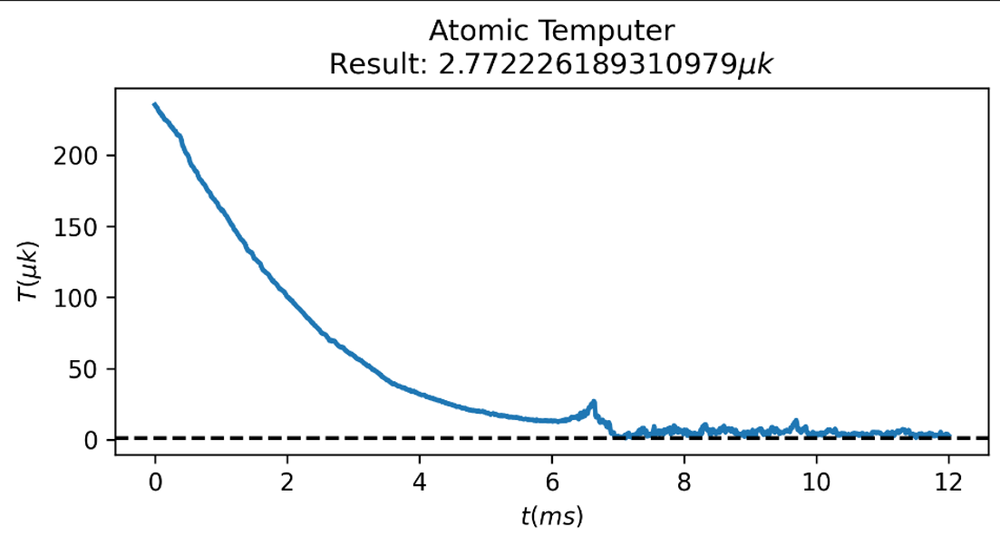

# PyLCP-CAI: Simulation of Cold Atom Interferometers Based on PyLCP

This is a simulation of cold atom interferometers based on PyLCP. For the laser-atom interaction module, we call the PyLCP library. It focuses more on the simulation of cold atom interferometers, especially cold atom interferometric gyroscopes. Users can also modify the parameters to simulate other cold atom interferometers, such as cold atom clocks, cold atom interferometric gravimeters, and cold atom interferometric gradiometers. For the physical principles, please refer to our published paper [Construction of a program for physical simulation of cold atom interferometry](https://opg.optica.org/oe/fulltext.cfm?uri=oe-33-3-6373&id=567893).

## 🚀 Key Features

### Module Classification
The simulation process of cold atom interferometers is divided into four modules: cooling, launching, interference, and detection.
- Data is stored in H5 files.
- You can choose to randomly generate atoms at the start.
- You can also choose to continue the calculation using the results of the previous module.

### Focus on Testing
If you need to simulate the evolution of a large number of atoms, you can refer to [PylcpGPU](https://github.com/EugeneZhu0505/PylcpGPU).
- It uses Jupyter Notebook for convenient testing.
- You can change parameters according to your needs, such as light fields, magnetic fields, atomic states, and external noise.

### Strong Compatibility
- It is fully compatible with the original pylcp library.
- It supports all physical models (laser fields, magnetic fields, Hamiltonians, etc.).
- You can use it without modifying the existing code.
- External noise can be introduced.

## 📦 Installation

### Basic Dependencies
```bash
pip install -r requirements.txt
```
**Note**:A too high Python version may easily lead to Numpy incompatibility issues, which might be a problem with PyLCP. `requirements.txt` contains a set of dependency library versions that we have tested and found to be suitable. A Python version of 3.8.20 is more appropriate.
## 🎯 Quick Start

### Cooling Module
The files corresponding to the cooling module are `MOT_ALL.py` and `MOT_TEST.py`, which contain the functions of the cooling module and the test code respectively. The PyLCP library already has functions for 3D-MOT, but in cold atom interferometers, atoms usually go through a 2D-MOT process before the 3D-MOT process. Therefore, we added relevant classes and functions for 2D-MOT. Secondly, we simulate the random distribution of atoms in the vacuum chamber and generate information such as the initial positions, velocities, and Hamiltonians of the atoms.

#### Function Introduction
- `generate_atom`: Generates the positions, velocities, and Hamiltonians of atoms according to the initial atomic density, the length, width, and height of the vacuum chamber, and the initial atomic temperature.
- `MOT_2DBeams`: Inherits from `pylcp.fields.laserBeams` and defines parameters such as the propagation direction, polarization, intensity, and detuning of the beams in 2D-MOT.
- `MOT2D_module`: Configures the complete simulation system for 2D-MOT. `generate_random_solution_2D_eqn` uses the rate equation `pylcp.rateeq` for evolution, and `generate_random_solution_2D_obe` uses the optical Bloch equation `pylcp.obe` for evolution.
- `Relmagnetic`: Calculates the combined magnetic field distribution generated by the anti-Helmholtz coils, which is used for the atomic evolution in 2D-MOT and 3D-MOT. Of course, it can also be changed to a Helmholtz coil by changing the current direction.
- `MOT3D_module`: Configures the complete simulation system for 3D-MOT. Similar to 2D-MOT, it can use two equations for evolution.

**Note**: Both the rate equation `pylcp.rateeq` and the optical Bloch equation `pylcp.obe` can be used for atomic evolution. The optical Bloch equation has a more comprehensive energy level construction, while the rate equation requires less computational resources.

#### Usage
The `MOT_TEST.py` code corresponds to all the test codes for the cooling module and the launching module. The meanings of the parameters and the functions of the code are annotated in the code. In addition, some content needs more detailed explanation. Note that `Line n` below refers to the nth line in the `MOT_TEST.py` file.
- `Parameter Initialization`: Lines 1 - 113 include the process of parameter initialization, including but not limited to importing dependent libraries, generating the initial atomic states according to the initial conditions, and reading and storing the initial atomic states.
- `2D-MOT Evolution`: Lines 114 - 243 include the relevant parameters, the evolution process, and the plotting process of 2D-MOT. Note that in the 2D-MOT stage, we use the states $|F = 1\rangle$, $|F = 2\rangle$, $|F' = 0\rangle$, $|F' = 1\rangle$, $|F' = 2\rangle$, $|F' = 3\rangle$, a total of 24 magnetic sublevels. Therefore, the shape of $N$ for a single atom at a specific time is $24\times1$, and the shape of the density matrix $\rho$ is $24\times24$. These magnetic sublevels of the ground states are arranged in ascending order of their serial numbers. Therefore, when extracting the atomic state density distribution, you need to check the composition of the states. When transferring this information to other modules, you also need to pay attention because the states used in different modules are not exactly the same. We simplify the state distribution to simplify the calculation. If you need to consider more comprehensive energy levels, you can add other energy levels of the $^{87}\text{Rb}$ atom in `MOT_ALL.py`.
- `3D-MOT Evolution`: Lines 244 - 364 include the relevant parameters, the evolution process, and the plotting process of 3D-MOT.

#### Problem Solving
During the development of the cooling module simulation, we also encountered some problems. These problems may not affect the overall operation of the code, but if they can be fixed, it will contribute to this project.
- **Testing of Multiprocessing Code**
`pathos` is a multiprocessing library that can call multiple CPU cores to run the same code, thereby accelerating the computation. Referring to [PyLCP](https://python-laser-cooling-physics.readthedocs.io/en/latest/index.html), we can call it in the following way. We use Jupyter Notebook to test the code for convenient operation. However, sometimes the code may get stuck in an infinite loop and cannot exit. In this case, we usually recommend copying all the code to a new folder without saving it, which can solve the problem. The purpose of the test code is to determine whether the current multiprocessing function `pathos.pools.ProcessPool` will encounter the above problems.
```python
Natoms = 96
chunksize = 4
sols = []
progress = progressBar()
for jj in range(int(Natoms/chunksize)):
    with pathos.pools.ProcessPool(nodes=4) as pool:
        sols += pool.map(generate_random_solution, range(chunksize))
    progress.update((jj+1)/int(Natoms/chunksize))
```

### Launching Module
The files corresponding to the launching module are `UP_PGC.py` and the second half of `MOT_TEST.py`, which contain the functions of the launching module and the test code respectively. Generally speaking, both the launching module and the cooling module are the preparation stages for atoms. In the cooling module, atoms reach the Doppler cooling limit through MOT. In the launching module, we change the detuning of the 3D-MOT light to launch the cooled atoms upward and apply PGC to lower the atomic temperature.

#### Function Introduction
- `atomic_UP_3DMOTBeams`: Defines the beams in the 3D-MOT region during the launching process. Different from the definition of the 3D-MOT beams in the cooling module, the launching process needs to adjust the detuning of the beams to give the stationary atomic cloud an upward force, thereby obtaining an upward velocity.
- `atomic_UP_process`: Configures the complete simulation system for the launching process. Similar to the definition in the cooling module, it can use two equations for evolution. The function has a new judgment, and the results obtained by using either eqn or obe for evolution in the cooling stage can be passed into the function.
- `atomic_PGC_3DMOTBeams`: Configures the beams in the 3D-MOT region during the polarization gradient cooling (PGC) process. In this process, the detuning of the beams changes with time.
- `atomic_PGC_process`: Configures the complete simulation system for the PGC process. Similar to the `atomic_UP_process` function, it can accept results in any form (eqn/obe) and use any method for evolution. The functions `generate_obe_solution_PGC` and `generate_obe_solution_PGC1` represent evolving the atoms with user-given initial states or using the results from the previous stage as the initial values for the PGC evolution process, respectively.

#### Usage
Note that `Line n` below refers to the nth line in the `MOT_TEST.py` file.
- `Launching Process`: Lines 365 - 517 include the relevant parameters, the evolution process, and the plotting process of the launching process. The plotting process includes not only the distribution of the atomic state density but also the calculation of the atomic temperature through the standard deviation of the atomic velocities.
- `PGC Process`: Lines 518 - 667 include the relevant parameters, the evolution process, and the plotting process of the PGC process.

#### Problem Solving
We tried to simulate the PGC process and found that it is a challenging task. In the PGC process, the detuning of the beams changes continuously with time, which we have solved. However, in the simulated `time-temperature` graph of the PGC process (as shown in the figure below), there is a strange temperature increase at about 6.5 ms. The existing theory cannot explain this phenomenon, and it is difficult to verify it in experiments. It may be due to an error in our simulation system, or it may be an unknown area yet to be discovered. This is worthy of further exploration.
<p align="center"></p>

### Interference Module
The interference module is the focus of our work. In this module, we simulate the three-pulse interferometer (M-Z-3) and the four-pulse interferometer (M-Z-4) of the Mach-Zehnder interferometer, as well as the Bragg diffraction atomic interferometer (bragg). The M-Z interferometer is based on two-photon transitions. [PyLCP](https://python-laser-cooling-physics.readthedocs.io/en/latest/index.html) focuses more on the interaction between atoms and electromagnetic fields. Based on the two-photon transition theory, we construct relevant functions for the interaction between atoms and lasers in the Raman process on the basis of the obe class in [PyLCP](https://python-laser-cooling-physics.readthedocs.io/en/latest/index.html). At the same time, we construct relevant functions for the Bragg diffraction atomic interferometer based on the two-photon Bragg diffraction effect. `gclass.py` and `gravity.py` are the functions related to the gravitational evolution in Raman interference and Bragg diffraction, respectively. `ramanclass.py` is the function related to Raman interference. `33.py` and `44.py` correspond to the test codes for the three-pulse interferometer and the four-pulse interferometer, respectively. `braggclass.py` is the function related to Bragg diffraction, and it is also the test code for the Bragg diffraction atomic interferometer.

#### Function Introduction
- `emovtion_atom`: This function exists in both `gclass.py` and `gravity.py`, and it is the function for gravitational evolution in Raman interference and Bragg diffraction, respectively.
- `Process_atom`: Similar to `emovtion_atom`, it also exists in both `gclass.py` and `gravity.py`. It is a function for batch processing the coordinate transformation and evolution of multiple atoms in gravitational evolution.
- `gaussian_t`: Exists in `ramanclass.py`. By inheriting the beam definition function in [PyLCP](https://python-laser-cooling-physics.readthedocs.io/en/latest/index.html), it allows the light intensity to change with time and can control the switching of light during the evolution process.
- `Raman_module`: Exists in `ramanclass.py`. Based on the two-photon transition theory, it modifies the class in [PyLCP](https://python-laser-cooling-physics.readthedocs.io/en/latest/index.html) to simulate the interaction between atoms and electromagnetic fields in the Raman process.
- `Bragg`: Exists in `braggclass.py`. Based on the Bragg diffraction effect, it modifies the class in [PyLCP](https://python-laser-cooling-physics.readthedocs.io/en/latest/index.html) to simulate the Bragg diffraction process.

#### Usage
We will take the test file `44.py` of the four-pulse interferometer as an example to introduce the usage of the Raman module.
 - `Raman Rabi`: The principle of Raman Rabi is to verify the proportion of the number of ground-state atoms caused by different laser interaction times, with the aim of finding the optimal Raman light interaction time during the interference process. In our code, we achieve this by modifying the interaction time of the first Raman light. That is, the Raman spectrum can be regarded as an extension of the first pulse interaction time. You can find the parameter initialization in `Line 143 - Line 224` of `44.py`. We increase the parameter `t1_rm1` and then apply the first Raman process in `Line 143 - Line 224` to obtain the Raman Rabi. The time corresponding to the maximum value of $|F = 2\rangle$ in the Raman Rabi is the time $\tau$ required for the complete inversion in the two-photon transition, which is also the time corresponding to the $\pi$ pulse.
 - `Raman Spectrum`: The principle of the Raman spectrum is to scan the proportion of the number of ground-state atoms near the resonance frequency, with the aim of finding the optimal laser frequency. You can find the evolution code of the Raman spectrum in `Line 271 - Line 306` of `44.py`. `w_scan1` and `w_scan2` are the initial and cut-off frequencies for scanning, and `raman1_num` is the number of scanning points. It should be noted that during the process of scanning the Raman spectrum, the interaction time `t1_rm1` of the Raman light needs to be modified to the optimal time $\tau$ obtained from the Raman Rabi scan.
 - `Four-Pulse Interferometer`: As can be seen, our code is written in the order of $\pi/2 - \pi - \pi - \pi/2$, and it also includes the gravitational evolution process in between. Therefore, whether it is the simulation of the three-pulse interferometer or the four-pulse interferometer, the results need to be saved in a timely manner during the evolution process to prevent problems caused by environmental crashes.
 - `Bragg Interferometer`: The test code for the Bragg diffraction atomic interferometer is similar to the Raman interference process, so it will not be elaborated here.

#### Problem Solving
 - `Raman Spectrum`: Only the effective wave vector in a single direction $+k_{eff}/-k_{eff}$ is used in the evolution process. Therefore, we cannot scan a Raman spectrum with three peaks in the Raman spectrum scan.
 - `Order Confusion`: It can be noted that in our evolution process, there will be a problem of assignment confusion when extracting the solutions. That is, sometimes the $|F = 1\rangle$ state is from 0:3, and sometimes it is from 5:8. This is a problem caused by the internal Hamiltonian writing process, and we will improve this problem in the subsequent versions.
### Detection Module
The detection module corresponds to `detection_module.py` and `detection_test.py`. In the detection module, we mainly simulate the TOF (Time of flight) method. By simulating the CCD collecting the photons spontaneously emitted by atoms, we obtain the ratio of the number of atoms in the ground states $|F = 1\rangle$ and $|F = 2\rangle$ according to the time-voltage graph of the CCD, and obtain the atomic temperature through Gaussian fitting. In the detection process, we divide it into three processes: the detection of $|F = 2\rangle$ process (referred to as the detection process), the Blow process, and the detection of $|F = 1\rangle$ process (referred to as the pumping process).

#### Function Introduction
- `rectangularBeam`: This function inherits from `PyLCP`'s `laserBeam`. By modifying this class, it defines a rectangular beam to better simulate the actual beam situation in the detection process.
- `detection_module`: Configures the complete simulation system for the detection process. Here, the detection refers to the detection of the $|F = 2\rangle$ state. The definition method is similar to the above modules. The `turn_position` function adjusts the position of the light. Here, we convert the adjustment of the light position to the adjustment of the atomic position, and the beam center is always at the origin.
- `Blow_module`: Configures the complete simulation system for the Blow process. The definition method is similar to the detection process, but the difference is that the Blow light has no return light. We need to blow away the atoms in the $|F = 2\rangle$ state to facilitate the detection of the atoms in the $|F = 1\rangle$ state.
- `detection_pumping`: Configures the complete simulation system for the pumping process. On the basis of the above detection light, by adding a pumping light from $|F = 1\rangle\rightarrow|F' = 1\rangle$, the detection of the atoms in the $|F = 1\rangle$ state is realized.
- `detection_tof_module`: Simulates the process of the CCD collecting the photon fluorescence generated by the spontaneous emission of atoms, taking into account the collection angle of the CCD, the acceptance efficiency, and the signal filtering.

#### Usage
Note that `Line n` below refers to the nth line in the `detection_test.py` file. The first two processes use the states $|F = 1\rangle$, $|F = 2\rangle$, $|F' = 3\rangle$, and the last process uses the states $|F = 1\rangle$, $|F = 2\rangle$, $|F' = 1\rangle$, $|F' = 3\rangle$. Therefore, if you need to inherit the results of the Raman process for evolution, you need to note that the Raman process only assigns values to the two ground states, and the initial values of the excited states are set to 0.
- `Parameter Initialization`: Lines 1 - 36 are the process of parameter initialization for the detection process, including importing dependent libraries and assigning initial parameters. Of course, the detection module may also encounter the multiprocessing code problem mentioned in the cooling module. If necessary, you can also add test code here.
- `Detection Process`: Lines 70 - 236 are the code for the detection process. Here, the detection process refers to the process of detecting the atoms in the $|F = 2\rangle$ state. The force distribution map and the atomic state density distribution map of the atoms are mainly used to observe the changes of the atoms during the evolution process. We use subplots, but you can also distinguish these atoms with different line segments and put them on one graph. There is also the evolution of the fluorescence collection system and the fitting of the TOF signal.
- `Blow Process`: Lines 237 - 297 are the relevant code for the Blow process. In real-world experiments, after the atomic cloud passes through the Blow light, the atoms in the ground state $|F = 2\rangle$ will resonate with the Blow light and obtain a large velocity, thus being "blown away". In the simulation, the criterion is that if the velocity of an atom along the Blow light is higher than a threshold, we consider that the atom is blown away.
- `Pumping Process`: Lines 298 - 503 are the relevant code for the pumping process, which also includes some code for data storage. The rest is similar to the above detection process, but a new pumping light from $|F = 1\rangle\rightarrow|F' = 1\rangle$ is added.

#### Problem Solving
- **Process Combination**: As you can see, in the above process, we separate the detection of $|F = 2\rangle$, the Blow process, and the detection of $|F = 1\rangle$. This undoubtedly increases the code redundancy. We tried to combine the three processes into one process, but failed. The reason has not been found yet. If you can help us solve this problem, we will be very grateful.
- **Evolution Problem**: Compared with the previous modules, we encountered an evolution problem in the detection module. You may notice that we added a code to remove atoms with incorrect shapes in the detection module. This is because some atoms exit the calculation before the given time during the evolution process, and the information of these atoms does not contain the complete evolution process. Our solution is to remove these atoms with incorrect shapes. We have not found out where the problem lies. Fortunately, the proportion of these atoms is not high. Of course, if this problem can be solved, it will make this project more perfect.


## 📁 Project Structure

```
PYLCP-CAI/
├── 33.py               # Test file for three-pulse interference
├── 44.py               # Test file for four-pulse interference
├── ramanclass.py       # Raman interference function
├── braggclass.py       # Bragg function file
├── braggtest.py        # Bragg test file
├── detection_module.py # Detection function file
├── detection_test.py   # Detection test file
├── gclass.py           # Bragg gravitational evolution function file
├── gravity.py          # Raman gravitational evolution function file
├── MOT_ALL.py          # Cooling function file
├── MOT_TEST.py         # Cooling and launching test file
├── UP_PGC.py           # Launching function file
├── README.md           # This file
├── fig1.png            # Image for README.md
└── requirements.txt    # Dependency list
```
## 🤝 Contribution

Welcome to submit issue reports and feature requests!
Author information:

Zhao Yingpeng：2112009046@zjut.edu.cn/yingpeng-zhao@mail.tsinghua.edu.cn

Bao Shuning：221122090120@zjut.edu.cn

Zhang Cheng：202003160319@zjut.edu.cn
##

## 📄 License
This project follows the same license as the original PyLCP.

## 🙏 Acknowledgments

- Developers of the original PyLCP library
- Developers of all dependent libraries
- All contributors and test users

---

